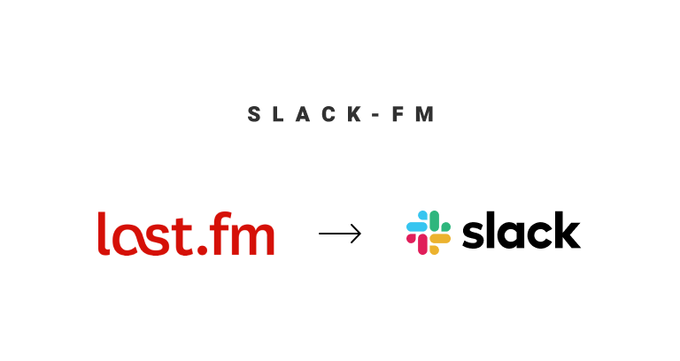
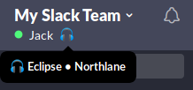

<p align="center">
  
  <br />
  <a href="https://travis-ci.org/JackCuthbert/slack-fm">
    
  </a>
  <a href="https://hub.docker.com/repository/docker/jckcthbrt/slack-fm">
    
  </a>
</p>

## Introduction

**Slack-fm** is a tiny self-hosted service that automatically updates your Slack
status from your Last.fm profile.

1. Updates your Slack status when
    * something is playing and a custom status hasn't been set
    * the time is between 9am and 5pm (configurable)
    * it's not a weekend (configurable)
1. Clears your Slack status when
    * a custom status has not been set, nothing is playing, and inside active hours
    * a custom status has not been set and outside active hours

It looks like this:



## Prerequisites

1. Last.fm API key ([get one here](https://www.last.fm/api/account/create))
1. Last.fm username (this is probably your own username!)
1. Slack "legacy" token ([get one here](https://api.slack.com/custom-integrations/legacy-tokens))

## Configuration

All configuration is available via environment variables. Values _without_ defaults are required.

Variable | Default | Description
---------|---------|------
`LAST_FM_KEY` | | Access to Last.fm data
`LAST_FM_USERNAME` | | Which user to get track info for
`SLACK_TOKEN` | | Personal "legacy" token for updating your Slack status
`SLACK_EMOJI` | `:headphones:` | Specify which emoji to use in the status
`SLACK_SEPARATOR` | `•` | Specify which character to use as a separator between the track name and artist
`TZ` | `UTC` | Set the timezone
`ACTIVE_HOURS_START` | `9` | The hour of the day to start updating your Slack status
`ACTIVE_HOURS_END` | `17` | The hour of the day to stop updating your Slack status
`UPDATE_INTERVAL` | `1` | The time in minutes to wait until updating your Slack Status
`UPDATE_WEEKENDS` | `undefined` | Provide any value to enable status updates during the weekend

## Hosting

I designed this to be easily self hosted, just use the Docker image! It's
automatically built and versioned on [Docker Hub](https://hub.docker.com/repository/docker/jckcthbrt/slack-fm/tags) based on GitHub activity.

### Docker run

```bash
docker run \
  -e SLACK_TOKEN=<YOUR_SLACK_TOKEN> \
  -e LAST_FM_KEY=<YOUR_LAST_FM_KEY> \
  -e LAST_FM_USERNAME=<LAST_FM_USERNAME> \
  -e TZ=<YOUR_TIMEZONE> \
  jckcthbrt/slack-fm:latest
```

### Docker compose

```yml
version: '3.7'
services:
  slack_fm:
    image: jckcthbrt/slack-fm:latest
    container_name: slack_fm
    restart: unless-stopped
    environment:
      TZ: <YOUR_TIMEZONE>
      SLACK_TOKEN: <YOUR_SLACK_TOKEN>
      LAST_FM_KEY: <YOUR_LAST_FM_KEY>
      LAST_FM_USERNAME: <LAST_FM_USERNAME>
```

```bash
docker-compose up
```

## Contributing

This should be relatively simple to set up and run, all that's required is Node
v12 and some environment variables.

1. Fork this repository and clone your version
1. Install dependencies with `npm install`
1. Run the tests with `npm test`
1. Set up your environment variables as above ([direnv](https://direnv.net) is great for this)
1. Start the app locally with `npm start`
1. Commit and push your changes then submit a PR back to this repository

